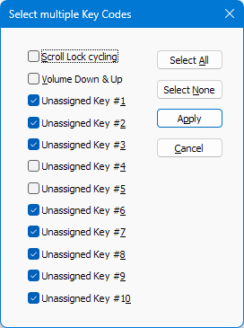

## Input Simulation Options

StayAwake can randomly pick any of the 12 key codes during each simulation. In this popup, users can specify _at least_ one OR a select few OR all of the 12 key codes to be included in the simulation roster.

#### Scroll Lock cycling
Scroll Lock toggling will work just fine for most users. However, some users using Remote Desktop alongside have reported spurious keystrokes being transmitted between the connected Windows devices. Users in such situations should explore other key simulation options.

#### Volume Up & Down
With this option, StayAwake will simulate a _Volume Down_ key press, immediately followed by a _Volume Up_ key press, thereby resulting in no net change in volume level.

A minor benefit with this option is the visual feedback. Each StayAwake key simulation event will cause the Windows Volume Slider bar to display for a few seconds above the Windows Taskbar.

However, if a user has muted the audio, then this option will unmute it. Users wishing to avoid this side effect should explore other key simulation options.

#### Unassigned Key (1 to 10)
With these options, StayWake will simulate key press of an unassigned keycode.

These unassigned keycodes have been obtained from this Microsoft article on [Virtual-Key Codes](https://learn.microsoft.com/en-us/windows/win32/inputdev/virtual-key-codes).

Microsoft may start utilizing any of these unassigned codes in the future -- but not all of them in one go. Hence all 10 of the currently unassigned codes have been included in the [Input Simulation Options](#input-simulation-options) popup so that users can select other still available unassigned keycodes.

#### Optional Tip
 You can verify StayAwake in action by *temporarily* enabling only the [Volume Up & Down](#volume-up--down) key code and setting both *Minimum Awake Seconds* and *Maximum Awake Seconds* fields to 10 seconds.
