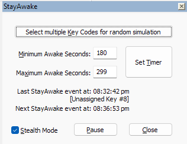
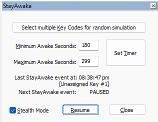
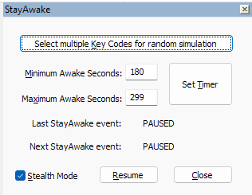
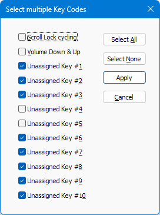
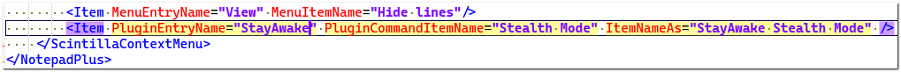
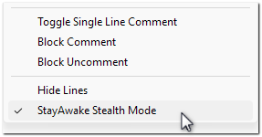

# StayAwake plugin for Notepad++

 &nbsp;&nbsp;&nbsp;&nbsp;&nbsp;

[Current Version: 1.2.0.0](https://github.com/shriprem/StayAwake_NPP_Plugin/blob/main/VersionHistory.md)

StayAwake is a simple, lightweight plugin for Notepad++ that enables you to maintain an _Active_ status on Microsoft Teams (and perhaps other messaging applications such as Slack and Zoom). StayAwake also prevents screen saver activation, screen blanking, and Windows session lockouts.

If you are using Microsoft Teams, you may have noticed that Teams automatically sets your status to _Away_ after a few minutes of inactivity. This can be frustrating if you are still at your desk but perhaps on a business phone call _OR_ outlining a plan on paper _OR_ consulting some reference material.

StayAwake does its job by simulating key presses of unused or low side-effect buttons at specified time intervals. This is a safe and non-intrusive way to keep your Microsoft Teams status _Active_.

* StayAwake will continue to run in the background even after its panel is closed.
* StayAwake will autostart with every Notepad++ session. There is no need to leave the panel open to have StayAwake autostart with Notepad++. For more info on this feature, see: [Stealth Mode](#stealth-mode)

## Plugin Panel

#### Select multiple Key Codes for random simulation
StayAwake can randomly pick any of the 12 key codes during each simulation. Users can specify _at least_ one OR a select few OR all of the 12 key codes to be included in the simulation roster. See the [Select multiple Key Codes](#select-multiple-key-codes) section below for more info.

#### Minimum Awake Seconds
This field allows you to specify the minimum interval between key simulations. The initial default value for this is 240 seconds (_i.e._, 4 minutes). However, you can change this to any value between 10 and 9990 seconds. Your new value will be saved and used the next time you run StayAwake.

#### Maximum Awake Seconds
This field allows you to specify the maximum interval between key simulations. The initial default value for this is 240 seconds (_i.e._, 4 minutes). However, you can change this to any value between 10 and 9990 seconds. Your new value will be saved and used the next time you run StayAwake.

#### Set Timer button
After changing the value for either *Minimum Awake Seconds* or *Maximum Awake Seconds*, click this button to apply the new setting. Clicking this button will also immediately invoke an Awake event.

After every Awake event, a random number of seconds (between the specified minimum and maximum seconds) will be picked to run the next Awake event.

The clock times of the last and next Awake events will be displayed and continually refreshed on the StayAwake window. The randomly picked key code used for the last Awake will also be displayed below the last Awake time.

#### Stealth Mode checkbox
The stealth mode can be turned ON/OFF either with this checkbox or via the Notepad++ menu option: *Plugins » StayAwake » Stealth Mode*. When stealth mode is active, the *Stealth Mode* menu option will have a checkmark indicator. See the [Stealth Mode](#stealth-mode) section below for more info.

#### Pause button
Click this button to pause StayAwake Key simulations.

As seen in the clip above, clicking the *Pause* button will also have these effects:
1. The *PAUSED* state will be indicated in the *Next StayAwake event* time slot.
2. The *Pause* button will change to _Resume_ mode. To exit the *PAUSED* state, click the **Resume** button.
3. If Notepad++ is closed while StayAwake is in paused mode, StayAwake will reopen in paused mode when Notepad++ is launched the next time. To exit the *PAUSED* state, click the **Resume** button.

   

#### Close button
Click this button to close the plugin panel and continue to run StayAwake in the background.

### Select multiple Key Codes

StayAwake can randomly pick any of the 12 key codes during each simulation. In this popup, users can specify _at least_ one OR a select few OR all of the 12 key codes to be included in the simulation roster.

#### Scroll Lock cycling
Scroll Lock toggling will work just fine for most users. However, some users using Remote Desktop alongside have reported spurious keystrokes being transmitted between the connected Windows devices. Users in such situations should explore other key simulation options.

#### Volume Up & Down
With this option, StayAwake will simulate a _Volume Down_ key press, immediately followed by a _Volume Up_ key press, thereby resulting in no net change in volume level.

A minor benefit with this option is the visual feedback. Each StayAwake key simulation event will cause the Windows Volume Slider bar to display for a few seconds above the Windows Taskbar.

However, if a user has muted the audio, then this option will unmute it. Users wishing to avoid this side effect should explore other key simulation options.

#### Unassigned Key (1 to 10)
With these options, StayWake will simulate key press of an unassigned keycode.

These unassigned keycodes have been obtained from this Microsoft article on [Virtual-Key Codes](https://learn.microsoft.com/en-us/windows/win32/inputdev/virtual-key-codes).

Microsoft may start utilizing any of these unassigned codes in the future -- but not all of them in one go. Hence all 10 of the currently unassigned codes have been included in the [Select multiple Key Codes](#select-multiple-key-codes) popup so that users can select other still available unassigned keycodes.

### Stealth Mode
Beginning with the v1.1.0.0 release, StayAwake will autostart with every Notepad++ session. This means that there is no need to leave the panel open to have StayAwake autostart with Notepad++.

 After its autostart, StayAwake will keep simulating the selected Awake keycode at specified intervals unless it had been paused in a previous Notepad++ session.

 The stealth mode can be turned ON/OFF either with the [Stealth Mode](#stealth-mode-checkbox) checkbox or via the Notepad++ menu option: *Plugins » StayAwake » Stealth Mode*. When stealth mode is active, the *Stealth Mode* menu option will have a checkmark indicator.

 When stealth mode is *NOT* active:
1. StayAwake will suspend its activity. i.e., StayAwake will stop simulating the Awake keycodes.
2. As of the v1.1.0.0 release, StayAwake's suspended state will be indicated only by the absence of checkmark in the menu option; it is not being indicated anywhere else on the plugin panel.
3. StayAwake's suspended state will not carry over to future Notepad++ sessions -- a distinction to note during the choice of using the *Stealth Mode* menu option vs. the [Pause](#pause-button) button on the panel.

#### Optional Tips

 * You can verify the stealth mode feature in action by *temporarily* enabling only the [Volume Up & Down](#volume-up--down) key code and setting both *Minimum Awake Seconds* and *Maximum Awake Seconds* fields to 10 seconds.

 * You can add the *Stealth Mode* menu option to Notepad++'s right click menu by editing the **contextMenu.xml** file of Notepad++.

   For example, add the following line of text to the **contextMenu.xml** file:

   `<Item PluginEntryName="StayAwake" PluginCommandItemName="Stealth Mode" ItemNameAs="StayAwake Stealth Mode" />`

   At the location indicated in this clip:
   

   Save changes to the xml file and restart Notepad++. *StayAwake Stealth Mode* menu option will start displaying in Notepad++'s right click menu, as seen in this clip:

   

## Configuration File Details
StayAwake saves its configuration in a file named `StayAwake.ini`. These key-value pairs are stored in this file:

1. `SelectedKeyCodes`: This key stores a string of 12 characters -- each character indicating if a key code in the [Select multiple Key Codes](#select-multiple-key-codes) popup is selected or not with either a `1` or `0`, respectively.

2. `MinimumIntervalInSeconds`: This key stores the minimum number of seconds between each StayAwake Key simulation as specified in the [Minimum Awake Seconds](#minimum-awake-seconds) field.

   The `MinimumIntervalInSeconds` value must be an integer between 10 and 9990. Values outside this range will be ignored and the default value of 240 seconds will be used instead.

3. `MaximumIntervalInSeconds`: This key stores the maximum number of seconds between each StayAwake Key simulation as specified in the [Maximum Awake Seconds](#maximum-awake-seconds) field.

   The `MaximumIntervalInSeconds` value must be an integer between 10 and 9990. Values outside this range will be ignored and the default value of 240 seconds will be used instead.

4. `AwakePaused`: This key stores a flag value (_Y_ or _N_) to indicate if StayAwake is in paused state.

## Alternatives

### StayAwake standalone application
StayAwake is also available as a [standalone application](https://github.com/shriprem/StayAwake). This version can be useful if you are not a Notepad++ user.

### Adobe PDF Full screen hack
If you are only looking for a way to block screen saver activation and session lockouts, you do not actually need the StayAwake plugin. Instead, you can simply open a PDF document in full screen mode in Adobe Acrobat (Reader | Professional), and leave it open in the background. This will prevent your screen saver from activating, and also prevent your Windows session from locking out.

**Note**: Full screen mode is different than maximized window state. To view a PDF document in full screen mode in Adobe Acrobat (Reader | Professional), either use:
* The menu option: *View » Full screen mode*
* Or the much quicker keyboard shortcut: *Ctrl + L*.

However, if you are looking for a way to keep your Microsoft Teams status _Active_, then StayAwake is the right tool for you.

## Installation

Within Notepad++, you can install the StayAwake plugin using the Notepad++ Plugin Manager (**Plugins » Plugins Admin** menu option => **Available** tab).

After installing the StayAwake plugin, click on **Plugins » StayAwake » Show StayAwake Panel** menu option to start the utility.

